# Agent 产品使用逻辑与操作流程

本文基于当前 [agent brainstorm PRD](../.trellis/tasks/04-01-04-01-agent-profile-workflow/prd.md) 整理，目标是把最终产品的用户使用逻辑、操作流程和运行边界可视化，便于后续进入数据模型和 UI 设计。

## 1. 产品心智模型

用户不应该感知自己在配置底层 CLI，而应该感知自己在定义和使用“专家 Agent”。

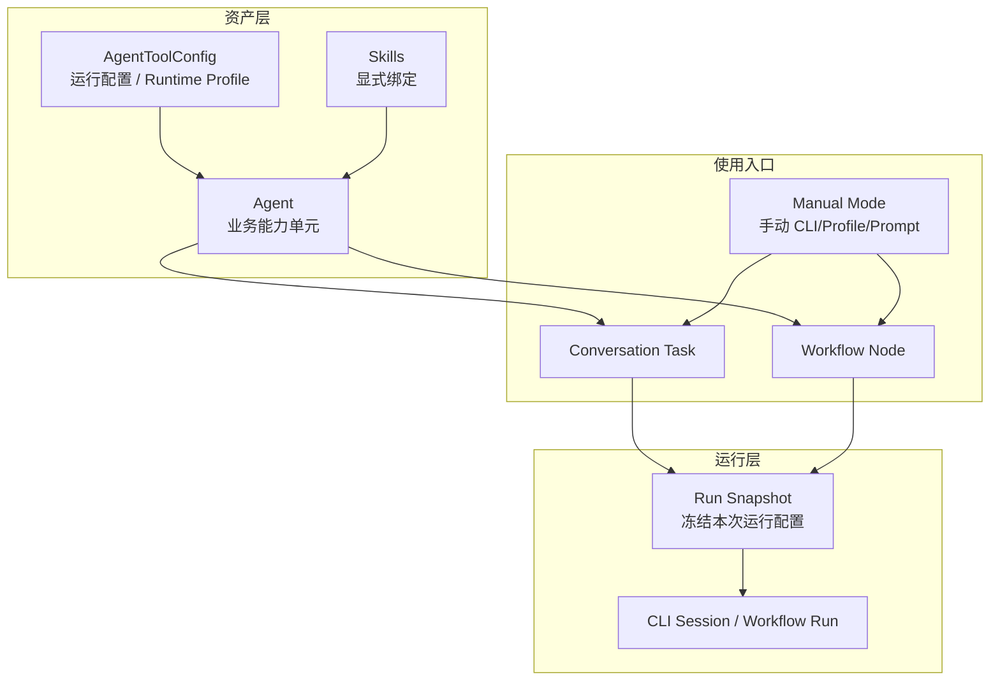

对应的产品逻辑是：

- `AgentToolConfig` 是底层 runtime profile，不是用户主概念。
- `Agent` 才是用户真正复用的“专家”。
- `Conversation` 和 `Workflow` 都可以引用 Agent。
- 一旦开始运行，就会创建 `Run Snapshot`。
- 历史运行是否可复现，取决于 snapshot 是否足够完整。

## 2. 用户角色与职责

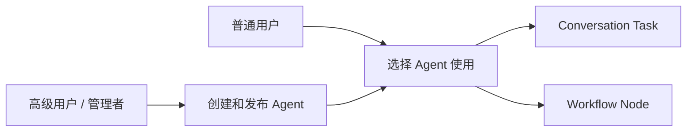

产品上默认存在两类用户：

- 高级用户负责沉淀和维护 Agent 资产。
- 普通用户直接消费 Agent，不需要理解底层 CLI 参数。

## 3. Agent 创建与发布流程

这是资产配置流程，不是运行流程。

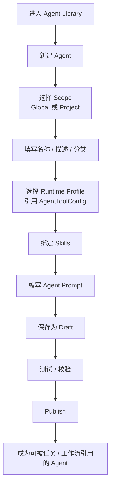

第一版推荐的资产侧操作顺序：

1. 创建 Agent。
2. 选择作用域。
3. 绑定 runtime profile。
4. 绑定 skills。
5. 编写 Agent prompt。
6. 保存草稿并发布。

## 4. Conversation 的用户使用流程

这是普通用户最直接的使用路径。

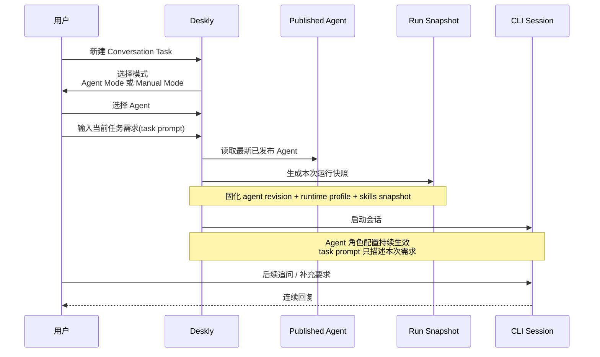

这里最关键的逻辑是：

- 用户输入的是当前需求，不是“你要扮演谁”。
- Agent 定义角色边界和可用能力。
- 后续 conversation 继续沿用同一个会话和同一个 Agent 身份。

## 5. Workflow 的用户使用流程

这是编排型使用路径。

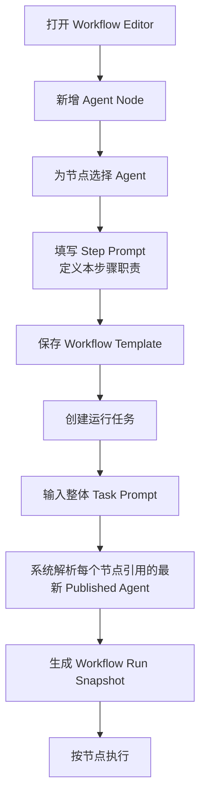

Workflow 场景下三层分工应该很清楚：

- Agent 定义“这个节点是谁”。
- Step Prompt 定义“这个节点这一步干什么”。
- Task Prompt 定义“这次整体任务是什么”。

## 6. Prompt 组合规则

第一版的 prompt 组合顺序如下：

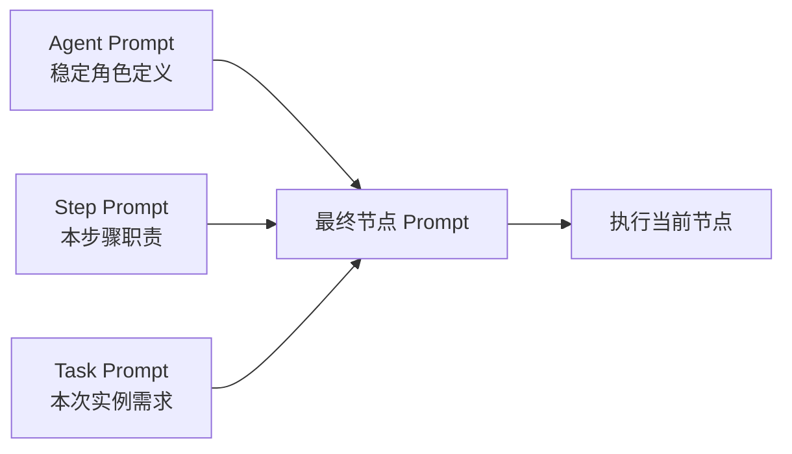

解释：

- `Agent Prompt` 负责长期稳定角色。
- `Step Prompt` 负责 workflow 节点的局部职责。
- `Task Prompt` 负责这次实例化请求。

Conversation 中通常没有 `Step Prompt`，但同样遵守 “Agent 在前，Task 在后” 的原则。

## 7. Agent 更新后的生效边界

这个流程决定“共享能力资产”是否可控。

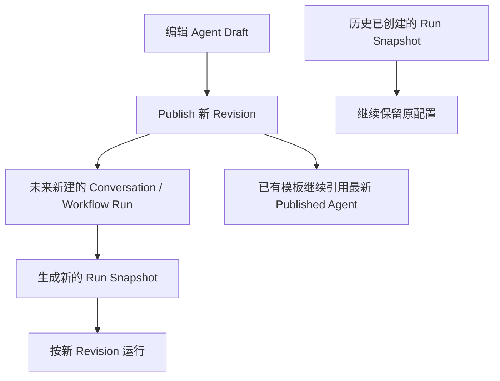

推荐的产品语义：

- 模板默认引用最新的已发布 Agent。
- 历史运行不回写，不受未来发布影响。
- Draft 不应直接影响未来运行。

## 8. Scope 可见性与引用规则

### 8.1 用户可见性

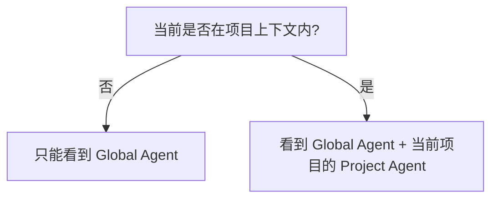

### 8.2 引用约束矩阵

| 使用场景 | 可引用 Global Agent | 可引用当前项目 Agent | 可引用其他项目 Agent |
| --- | --- | --- | --- |
| 无项目上下文的 conversation | Yes | No | No |
| 项目内 conversation | Yes | Yes | No |
| Global workflow | Yes | No | No |
| Project workflow | Yes | Yes | No |

这张矩阵的目的，是防止作用域穿透和模板在错误上下文里变成不可执行状态。

## 9. 与旧模式的并存关系

第一版不替代旧入口，而是新增高层入口。

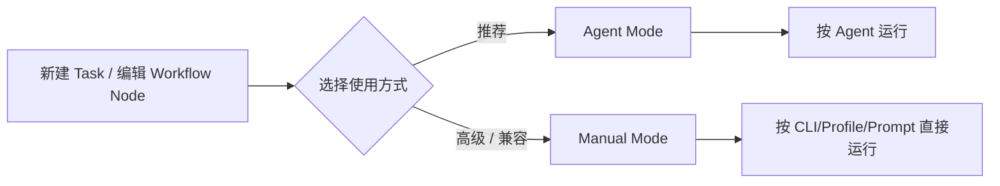

产品含义：

- 普通用户优先走 `Agent Mode`。
- 高级用户仍可使用手动模式。
- 第一版可以渐进引导，而不是强制替换。

## 10. 端到端操作流程

### 10.1 先创建 Agent，再让别人使用

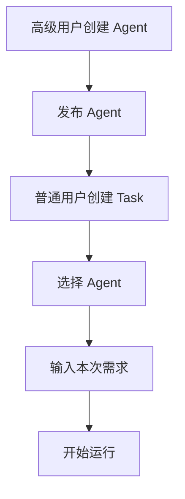

### 10.2 普通用户直接发起对话

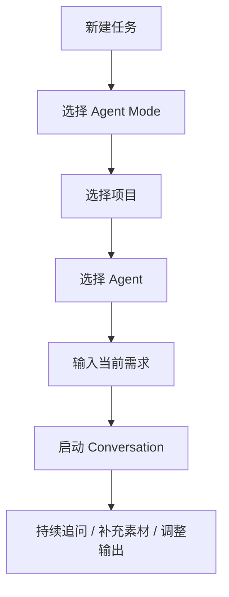

### 10.3 在 Workflow 中编排多个专家

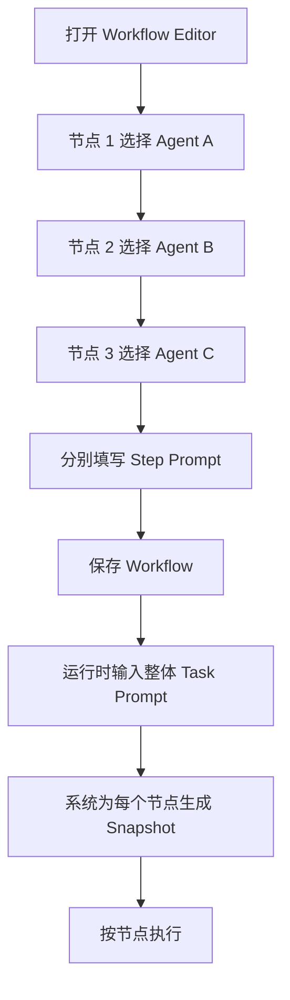

## 11. 第一版 UI 信息架构建议

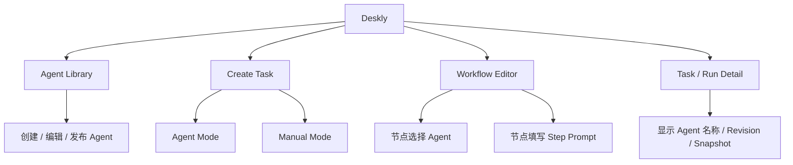

## 12. 最终产品一句话总结

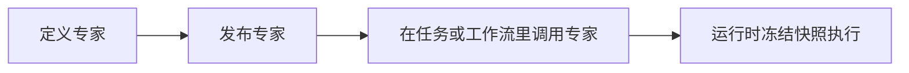

最终用户体验不应该是“我在配 CLI”，而应该是：

**我在定义专家、发布专家、调用专家，然后系统按本次快照执行。**
